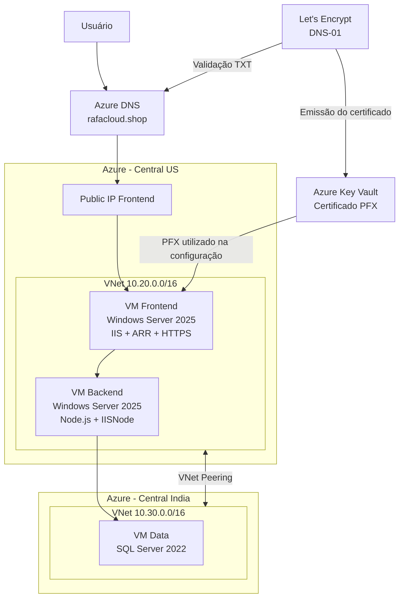
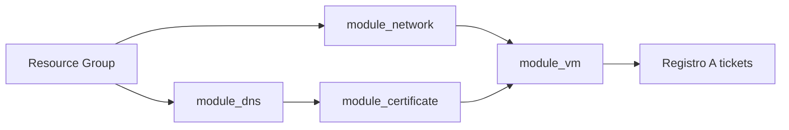

# Copa Azure 2026 — Plataforma de Venda de Ingressos

Projeto de infraestrutura como código desenvolvido com Terraform para provisionar uma plataforma de venda de ingressos da Copa do Mundo de 2026 no Microsoft Azure.

A solução cria uma arquitetura distribuída em duas regiões, composta por máquinas virtuais Windows para frontend, backend e banco de dados, redes virtuais com peering, Azure DNS, certificado HTTPS emitido pelo Let's Encrypt e armazenamento do certificado no Azure Key Vault.

## Status

Infraestrutura provisionada e aplicação validada de ponta a ponta, incluindo acesso HTTPS, cadastro de usuário e compra de ingresso.

---

## Visão geral

A infraestrutura possui três camadas principais:

* **Frontend:** aplicação web publicada no IIS.
* **Backend:** API Node.js executada por meio do IIS e iisnode.
* **Data:** SQL Server 2022 com o banco restaurado automaticamente por um arquivo BACPAC.

O acesso externo à aplicação é realizado pelo endereço:

```text
https://tickets.rafacloud.shop
```

O certificado HTTPS é emitido automaticamente pelo Let's Encrypt utilizando o desafio DNS-01 no Azure DNS.

---

## Arquitetura



---

## Tecnologias utilizadas

* Terraform
* Microsoft Azure
* Azure Virtual Machines
* Azure Virtual Network
* Azure Network Security Group
* Azure DNS
* Azure Key Vault
* Let's Encrypt
* ACME
* Windows Server
* IIS
* Application Request Routing
* IIS URL Rewrite
* IISNode
* Node.js
* SQL Server 2022
* PowerShell

---

## Providers Terraform

O projeto utiliza os seguintes providers:

| Provider            | Finalidade                                           |
| ------------------- | ---------------------------------------------------- |
| `hashicorp/azurerm` | Provisionamento dos recursos no Azure                |
| `hashicorp/tls`     | Geração da chave privada da conta ACME               |
| `vancluever/acme`   | Registro ACME e emissão do certificado Let's Encrypt |

Configuração principal:

```hcl
terraform {
  required_version = ">= 1.15.5"

  required_providers {
    azurerm = {
      source  = "hashicorp/azurerm"
      version = "4.75.0"
    }

    tls = {
      source  = "hashicorp/tls"
      version = ">= 4.0.0, < 5.0.0"
    }

    acme = {
      source  = "vancluever/acme"
      version = ">= 2.16.1, < 3.0.0"
    }
  }
}

provider "azurerm" {
  features {}
}

provider "acme" {
  server_url = var.acme_server_url
}
```

A configuração dos providers permanece no módulo raiz. Os módulos filhos apenas declaram os providers que utilizam.

---

## Estrutura do projeto

```text
Copa_Azure/
├── main.tf
├── provider.tf
├── variables.tf
├── outputs.tf
├── README.md
│
├── module_network/
│   ├── main.tf
│   ├── variables.tf
│   └── outputs.tf
│
├── module_dns/
│   ├── main.tf
│   ├── variables.tf
│   └── outputs.tf
│
├── module_certificate/
│   ├── main.tf
│   ├── variables.tf
│   └── outputs.tf
│
└── module_vm/
    ├── main.tf
    ├── variables.tf
    ├── outputs.tf
    ├── firewall.tf
    └── scripts/
        ├── configure-data.ps1.tftpl
        ├── configure-backend.ps1.tftpl
        └── configure-frontend.ps1.tftpl
```

---

## Organização dos módulos

### `module_network`

Responsável por criar toda a estrutura de rede.

Recursos principais:

* Network Security Group em Central US.
* Network Security Group em Central India.
* Virtual Network em Central US.
* Virtual Network em Central India.
* Subnet Frontend.
* Subnet Backend.
* Subnet Data.
* Associação dos NSGs às subnets.
* Peering bidirecional entre as VNets.

### Rede Central US

| Recurso         | Valor                  |
| --------------- | ---------------------- |
| VNet            | `vnet-prd-inf-cus-001` |
| CIDR            | `10.20.0.0/16`         |
| Subnet Frontend | `10.20.1.0/24`         |
| Subnet Backend  | `10.20.2.0/24`         |
| NSG             | `nsg-prd-inf-cus-001`  |

### Rede Central India

| Recurso     | Valor                  |
| ----------- | ---------------------- |
| VNet        | `vnet-prd-inf-cin-001` |
| CIDR        | `10.30.0.0/16`         |
| Subnet Data | `10.30.1.0/24`         |
| NSG         | `nsg-prd-inf-cin-001`  |

---

### `module_dns`

Responsável pela criação da zona DNS pública e do registro da aplicação.

Recursos principais:

* Zona DNS pública `rafacloud.shop`.
* Registro A `tickets`.
* Associação do registro ao IP público da VM Frontend.

Outputs fornecidos pelo módulo:

```hcl

output "dns_zone_name" {
  description = "Nome da zona pública criada no Azure DNS"
  value       = azurerm_dns_zone.dns_zone.name
}
```

O output `dns_zone_name` é utilizado pelo `module_certificate` para configurar o desafio DNS-01.

---

### `module_certificate`

Responsável por emitir, armazenar e disponibilizar o certificado HTTPS da aplicação.

Recursos principais:

* Chave privada da conta ACME.
* Registro da conta no Let's Encrypt.
* Emissão do certificado wildcard.
* Validação DNS-01 no Azure DNS.
* Azure Key Vault.
* Access Policy do Key Vault.
* Importação do certificado PFX no Key Vault.

Recursos criados pelo módulo:

```text
module.module_certificate.tls_private_key.acme_account_key
module.module_certificate.acme_registration.letsencrypt
module.module_certificate.acme_certificate.tickets
module.module_certificate.azurerm_key_vault.certificates
module.module_certificate.azurerm_key_vault_access_policy.terraform_current
module.module_certificate.azurerm_key_vault_certificate.tickets
```

#### Certificado emitido

O certificado possui:

```text
Common Name: *.rafacloud.shop
Subject Alternative Name: rafacloud.shop
```

O wildcard permite utilizar o certificado em subdomínios como:

```text
tickets.rafacloud.shop
```

#### Validação DNS-01

O provider ACME cria temporariamente um registro TXT semelhante a:

```text
_acme-challenge.rafacloud.shop
```

O Let's Encrypt consulta esse registro para confirmar que a zona DNS está sob controle da infraestrutura.

#### Azure Key Vault

O certificado é importado automaticamente para:

```text
Key Vault: kv-tk-cert-001
Certificado: cert-rafacloud-shop
```

O Key Vault utiliza Access Policies:

```hcl
rbac_authorization_enabled = false
```

A identidade que executa o Terraform recebe permissões para criar, importar, consultar, atualizar, recuperar e excluir certificados e secrets.


### `module_vm`

Responsável pela criação e configuração das máquinas virtuais.

O módulo também cria:

* Interfaces de rede.
* Endereços IP públicos.
* Discos gerenciados.
* Associações dos discos.
* Registro da VM Data como SQL Virtual Machine.
* Execução dos scripts PowerShell por meio de `azurerm_virtual_machine_run_command`.

---

## Máquinas virtuais

### VM Frontend

| Propriedade         | Valor                                        |
| ------------------- | -------------------------------------------- |
| Nome                | `vm-prd-tk-fend-cus-001`                     |
| Região              | Central US                                   |
| Sistema operacional | Windows Server 2025 Datacenter Azure Edition |
| SKU                 | `Standard_D2s_v3`                            |
| Servidor Web        | IIS                                          |
| Proxy reverso       | Application Request Routing                  |
| HTTPS               | Certificado Let's Encrypt                    |
| Hostname            | `tickets.rafacloud.shop`                     |

Responsabilidades:

* Publicar a aplicação frontend.
* Instalar e configurar IIS URL Rewrite e Application Request Routing.
* Receber conexões HTTP e HTTPS.
* Redirecionar chamadas `/api` para o Backend por meio do proxy reverso.
* Importar o certificado PFX no Windows.
* Criar o binding HTTPS com SNI no IIS.
* Validar o acesso HTTP, o proxy para o Backend e a configuração HTTPS.

O IIS External Cache não é utilizado, pois a arquitetura possui apenas uma instância de ARR no Frontend.

O PFX e o hostname são recebidos diretamente dos outputs do módulo de certificado:

```hcl
frontend_certificate_pfx_base64 = (
  module.module_certificate.certificate_p12
)

frontend_certificate_pfx_password = (
  var.certificate_pfx_password
)

frontend_certificate_hostname = (
  module.module_certificate.certificate_hostname
)
```

---

### VM Backend

| Propriedade         | Valor                                        |
| ------------------- | -------------------------------------------- |
| Nome                | `vm-prd-tk-bend-cus-001`                     |
| Região              | Central US                                   |
| Sistema operacional | Windows Server 2025 Datacenter Azure Edition |
| SKU                 | `Standard_D2s_v3`                            |
| Runtime             | Node.js 20                                   |
| Integração IIS      | IISNode                                      |
| Banco utilizado     | SQL Server da VM Data                        |

Responsabilidades:

* Instalar IIS.
* Instalar Node.js.
* Instalar IISNode.
* Instalar IIS URL Rewrite.
* Publicar a API.
* Criar o Application Pool.
* Criar o site no IIS.
* Gerar o arquivo `.env` em UTF-8 sem BOM.
* Tratar com segurança barras, aspas e quebras de linha nos valores gravados no `.env`.
* Manter compatibilidade com o Windows PowerShell 5.1 utilizado pelas VMs.
* Configurar a conexão com o SQL Server.
* Executar o health check da API.

---

### VM Data

| Propriedade           | Valor                     |
| --------------------- | ------------------------- |
| Nome                  | `vm-prd-tk-data-cin-001`  |
| Região                | Central India             |
| Sistema operacional   | Windows Server 2022       |
| Imagem                | SQL Server 2022 Developer |
| SKU                   | `Standard_D2s_v3`         |
| Porta SQL             | `1433`                    |
| Tipo de conectividade | `PRIVATE`                 |
| Licença               | `PAYG`                    |

Imagem utilizada:

```hcl
source_image_reference {
  publisher = "microsoftsqlserver"
  offer     = "sql2022-ws2022"
  sku       = "sqldev-gen2"
  version   = "latest"
}
```

A VM possui três discos Premium SSD de 8 GiB:

| Disco       | LUN | Cache    |
| ----------- | --: | -------- |
| Data Disk 0 |   0 | ReadOnly |
| Data Disk 1 |   1 | None     |
| Data Disk 2 |   2 | ReadOnly |

Responsabilidades:

* Aguardar a inicialização do SQL Server e validar que o serviço está em execução.
* Montar a conexão SQL com `SqlConnectionStringBuilder`.
* Validar o login administrativo e a resposta do banco `master`.
* Baixar o arquivo BACPAC.
* Instalar ou localizar o SqlPackage.
* Importar o banco de dados.
* Validar a quantidade esperada de registros nas tabelas `matches`, `stadiums` e `teams`.

Validações executadas:

| Tabela   | Quantidade esperada |
| -------- | ------------------: |
| Partidas |                 104 |
| Estádios |                  17 |
| Seleções |                  49 |

---

## Pacotes utilizados

### Banco de dados

```text
https://stotfteccopaazure.blob.core.windows.net/copa2026/FIFA2026Tickets.bacpac
```

### Backend

```text
https://stotfteccopaazure.blob.core.windows.net/copa2026/fifa2026-api.zip
```

### Frontend

```text
https://stotfteccopaazure.blob.core.windows.net/copa2026/fifa2026-web.zip
```

---

## Automação das máquinas virtuais

A configuração das VMs é realizada com:

```hcl
azurerm_virtual_machine_run_command
```

O uso de Run Command evita o limite de tamanho encontrado anteriormente com o `CustomScriptExtension`.

Recursos utilizados:

```text
module.module_vm.azurerm_virtual_machine_run_command.configure_data_cin
module.module_vm.azurerm_virtual_machine_run_command.configure_bend_cus
module.module_vm.azurerm_virtual_machine_run_command.configure_fend_cus
```

Ordem lógica de configuração:

```text
VM Data
   ↓
Importação e validação do banco
   ↓
VM Backend
   ↓
Instalação do Node.js, IISNode e publicação da API
   ↓
VM Frontend
   ↓
Configuração do IIS, URL Rewrite, ARR e HTTPS
```

---

## Dependências entre módulos

As dependências são criadas automaticamente pelas referências entre os módulos.



Fluxo principal:

```text
Resource Group
      ↓
module_network
      ↓
module_vm

module_dns.azurerm_dns_zone
      ↓
module_certificate
      ↓
module_vm.configure_fend_cus

module_vm.vm_public_ip_fend_cus
      ↓
module_dns.azurerm_dns_a_record.tickets
```

A ordem dos blocos no `main.tf` não define a ordem de criação. O Terraform monta o grafo de dependências utilizando as referências entre recursos e módulos.

---

## Regras de segurança de rede

O projeto cria regras para permitir:

### RDP em Central US

```text
Porta: 3389
Destino: VMs Frontend e Backend
```

### RDP em Central India

```text
Porta: 3389
Destino: VM Data
```

### HTTPS no Frontend

```text
Porta: 443
Destino: VM Frontend
```

As regras RDP estão abertas para qualquer origem no ambiente de laboratório. Em produção, o ideal é limitar o acesso a um IP confiável, VPN, Azure Bastion ou solução equivalente.

---

## Variáveis

As declarações ficam no arquivo:

```text
variables.tf
```

Os principais grupos de variáveis são:

* Resource Group.
* Redes de Central US.
* Redes de Central India.
* Máquinas virtuais.
* SQL Server.
* Azure DNS.
* Aplicação Backend.
* Aplicação Frontend.
* Banco de dados e BACPAC.
* ACME e Let's Encrypt.
* Key Vault e certificado HTTPS.

Variáveis sensíveis:

```text
admin_password
sql_admin_password
backend_jwt_secret
certificate_pfx_password
```
---

## Proteção de arquivos sensíveis

O arquivo `terraform.tfvars` não deve ser publicado no GitHub quando possuir senhas, secrets ou outras informações sensíveis.

Exemplo de `.gitignore`:

```gitignore
# Terraform
.terraform/
*.tfstate
*.tfstate.*
.terraform.lock.hcl
crash.log
crash.*.log

# Arquivos de variáveis com informações sensíveis
terraform.tfvars
*.auto.tfvars

# Planos Terraform
*.tfplan
tfplan

# Certificados e chaves
*.pfx
*.p12
*.pem
*.key

# Arquivos locais
.vscode/
```

A decisão de versionar `.terraform.lock.hcl` depende do fluxo adotado. Em projetos Terraform, normalmente é recomendado versioná-lo para manter as versões dos providers consistentes.

Nesse caso, remova esta linha do `.gitignore`:

```gitignore
.terraform.lock.hcl
```

---

## Pré-requisitos

Antes de executar o projeto, é necessário possuir:

* Terraform instalado.
* Azure CLI instalada.
* Acesso a uma assinatura Azure.
* Permissão para criar os recursos.
* Domínio registrado.
* Acesso ao gerenciador DNS do domínio.
* Sessão autenticada no Azure CLI.

Autenticação:

```powershell
az login
```

Validação da assinatura ativa:

```powershell
az account show
```

Quando necessário, selecione a assinatura correta:

```powershell
az account set --subscription "<SUBSCRIPTION_ID>"
```

O provider ACME utiliza:

```hcl
acme_azure_auth_method = "cli"
```

Isso permite reutilizar a sessão autenticada pelo Azure CLI.

---

## Inicialização do Terraform

Formate o projeto:

```powershell
terraform fmt -recursive
```

Inicialize os providers e módulos:

```powershell
terraform init
```

Valide a configuração:

```powershell
terraform validate
```

Resultado esperado:

```text
Success! The configuration is valid.
```

Gere o plano:

```powershell
terraform plan
```

Após a reorganização do certificado, os recursos devem aparecer apenas dentro de:

```text
module.module_certificate.*
```

Não devem existir recursos duplicados de ACME, TLS ou Key Vault diretamente no root.

O plano validado da configuração apresentou:

```text
Plan: 43 to add, 0 to change, 0 to destroy.
```

---

## Primeira implantação da zona DNS

O certificado depende da delegação pública da zona DNS.

Por isso, em uma implantação realizada após a exclusão da zona, primeiro crie apenas a zona DNS:

```powershell
terraform apply -target="module.module_dns.azurerm_dns_zone.dns_zone"
```

Consulte os Name Servers:

```powershell
terraform output dns_name_servers
```

Exemplo:

```text
ns1-01.azure-dns.com
ns2-01.azure-dns.net
ns3-01.azure-dns.org
ns4-01.azure-dns.info
```

Configure os servidores fornecidos pelo Azure no registrador do domínio.

No ambiente deste projeto, a delegação do domínio é configurada externamente no painel da Hostinger.

---

## Validação da delegação DNS

Após atualizar os Name Servers, valide utilizando um resolvedor público:

```powershell
Resolve-DnsName rafacloud.shop -Type NS -Server 8.8.8.8
```

Os servidores retornados devem ser iguais aos apresentados por:

```powershell
terraform output dns_name_servers
```

Também pode ser utilizado:

```powershell
nslookup -type=NS rafacloud.shop 8.8.8.8
```

A emissão do certificado só deve ser executada quando a zona estiver delegada corretamente.

---

## Implantação completa

Após confirmar a delegação DNS:

```powershell
terraform plan
terraform apply
```

O fluxo esperado é:

1. Criação do Resource Group.
2. Criação das VNets, subnets e NSGs.
3. Criação da zona DNS.
4. Emissão do certificado pelo Let's Encrypt.
5. Criação do Key Vault.
6. Importação do certificado no Key Vault.
7. Criação das máquinas virtuais.
8. Configuração do SQL Server e importação do BACPAC.
9. Configuração do Backend.
10. Configuração do Frontend.
11. Importação do PFX na VM Frontend.
12. Criação do binding HTTPS no IIS.
13. Criação do registro DNS `tickets`.
14. Validação dos endpoints.

---

## Outputs do root

O projeto disponibiliza:

```text
vm_public_ip_fend_cus
vm_public_ip_bend_cus
vm_public_ip_data_cin
dns_name_servers
certificate_key_vault_name
certificate_key_vault_uri
certificate_key_vault_certificate_name
certificate_key_vault_certificate_id
certificate_iis_hostname
certificate_not_after
```

Consulta:

```powershell
terraform output
```

Consulta de um output específico:

```powershell
terraform output certificate_iis_hostname
```

---

## Validações após o provisionamento

### DNS

```powershell
Resolve-DnsName tickets.rafacloud.shop -Type A -Server 8.8.8.8
```

O IP retornado deve ser o IP público da VM Frontend.

### Frontend HTTP

```powershell
Invoke-WebRequest http://tickets.rafacloud.shop
```

### Frontend HTTPS

```powershell
Invoke-WebRequest https://tickets.rafacloud.shop
```

### Health check do Backend pelo Frontend

```powershell
Invoke-WebRequest https://tickets.rafacloud.shop/api/health
```

### Certificado

No navegador, o certificado deve apresentar:

```text
Domínio: tickets.rafacloud.shop
Emissor: Let's Encrypt
Status: válido
```

## Validação funcional

Após o provisionamento, o fluxo completo da aplicação foi validado com sucesso:

* acesso ao site por `https://tickets.rafacloud.shop`;
* carregamento do Frontend via HTTPS;
* comunicação do Frontend com o Backend pelo proxy ARR;
* comunicação do Backend com o SQL Server;
* cadastro de usuário;
* autenticação;
* compra de ingresso;
* persistência das informações no banco de dados.

---

## Logs das configurações

### VM Data

```text
C:\Terraform\Logs\configure-data.log
```

### VM Backend

```text
C:\Terraform\Logs\configure-backend.log
```

### VM Frontend

```text
C:\Terraform\Logs\configure-frontend.log
```

Os logs podem ser consultados por RDP ou por comandos remotos no Azure.

---

## Solução de problemas

### Certificado duplicado no plano

Quando os recursos aparecem simultaneamente no root e no módulo:

```text
acme_certificate.tickets
module.module_certificate.acme_certificate.tickets
```

significa que ainda existe algum arquivo `.tf` antigo no root declarando os recursos.

Os recursos devem existir apenas em:

```text
module_certificate/main.tf
```

### Falha na validação DNS-01

Verifique:

* Delegação dos Name Servers.
* Zona DNS criada.
* Sessão autenticada no Azure CLI.
* Assinatura selecionada.
* Permissão para criar registros DNS.
* Tempo de propagação configurado.
* Ausência de registros TXT conflitantes.

### Referência inválida ao certificado

Não utilize no root:

```hcl
acme_certificate.tickets.certificate_p12
local.certificate_iis_hostname
```

As referências corretas são:

```hcl
module.module_certificate.certificate_p12
module.module_certificate.certificate_hostname
```

### Key Vault em soft delete

Mesmo após excluir um Key Vault, o nome pode continuar reservado devido ao soft delete.

Consulte:

```powershell
az keyvault list-deleted
```

Recupere ou remova definitivamente conforme necessário.

### Run Command com falha

Consulte os arquivos de log dentro das VMs e valide o status em:

```text
Virtual Machine
  └── Run command
```

Quando uma execução falha durante a criação, o recurso pode permanecer no Azure sem ser gravado no state do Terraform. Nesse caso, remova apenas o Run Command órfão antes de executar novamente:

```powershell
az vm run-command delete `
    --resource-group "rg-prd-tik-cus-001" `
    --vm-name "NOME_DA_VM" `
    --name "NOME_DO_RUN_COMMAND" `
    --yes
```

---

## Destruição do ambiente

Para remover a infraestrutura:

```powershell
terraform destroy
```

O certificado ACME está configurado com:

```text
revoke_certificate_on_destroy = true
```

Durante o destroy, o provider pode tentar revogar o certificado.

O Key Vault utiliza soft delete. Após a destruição, ele poderá permanecer na lista de recursos excluídos durante o período configurado.

---

## Objetivos técnicos do projeto

Este projeto demonstra:

* Modularização Terraform.
* Infraestrutura multirregional.
* Separação das camadas de aplicação.
* Peering entre Virtual Networks.
* Automação de máquinas virtuais Windows.
* Publicação automatizada no IIS.
* Configuração de proxy reverso.
* Restauração automatizada de banco SQL.
* Uso de Azure DNS.
* Emissão automática de certificado HTTPS.
* Validação DNS-01.
* Armazenamento do certificado no Azure Key Vault.
* Consumo de outputs entre módulos.
* Gerenciamento de dependências pelo grafo do Terraform.
* Tratamento de informações sensíveis.
* Automação com PowerShell e Run Command.

---

## Autor

**Rafael Biasotto**

Projeto desenvolvido para estudo e prática de Terraform, Microsoft Azure, automação de infraestrutura, redes, segurança, certificados e arquitetura em nuvem.
