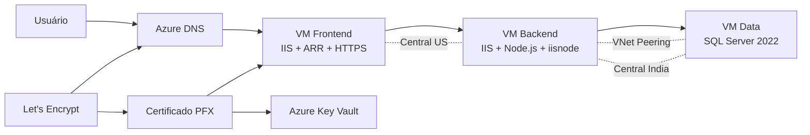

# Copa Azure 2026 — Plataforma de Venda de Ingressos

Projeto prático de infraestrutura como código desenvolvido durante a **Fase de Grupos da Copa Azure**, simulando uma plataforma de venda de ingressos para a Copa do Mundo de 2026.

Toda a infraestrutura é provisionada na Microsoft Azure utilizando Terraform. Além da criação dos recursos, o projeto também automatiza a configuração interna das máquinas virtuais, o deploy das aplicações, a importação do banco de dados e a configuração do certificado HTTPS.

O objetivo principal foi reduzir ao máximo as configurações manuais e deixar o ambiente pronto para uso após a execução do Terraform.

---

## Arquitetura

A aplicação foi dividida em três camadas:



O acesso externo acontece pelo endereço:

```text
https://tickets.rafacloud.shop
```

O frontend recebe as requisições HTTPS e utiliza o Application Request Routing do IIS como proxy reverso para encaminhar as chamadas da API ao backend pela rede privada.

O backend, por sua vez, acessa o SQL Server utilizando o endereço IP privado da VM Data.

---

## Tecnologias utilizadas

* Microsoft Azure
* Terraform
* AzureRM Provider
* TLS Provider
* ACME Provider
* Azure Virtual Machines
* Azure Virtual Network
* VNet Peering
* Network Security Groups
* Azure DNS
* Azure Key Vault
* Windows Server 2025
* Windows Server 2022
* SQL Server 2022
* IIS
* Application Request Routing
* URL Rewrite
* Node.js
* iisnode
* PowerShell
* Let’s Encrypt

---

## Recursos provisionados

### Resource Group

Todos os recursos são criados no mesmo Resource Group:

```text
rg-prd-tik-cus-001
```

### Rede em Central US

| Recurso                | Nome                        | Endereçamento      |
| ---------------------- | --------------------------- | ------------------ |
| Virtual Network        | `vnet-prd-inf-cus-001`      | `10.20.0.0/16`     |
| Subnet Frontend        | `snet-prd-inf-fend-cus-001` | `10.20.1.0/24`     |
| Subnet Backend         | `snet-prd-inf-bend-cus-001` | `10.20.2.0/24`     |
| Network Security Group | `nsg-prd-inf-cus-001`       | Frontend e Backend |

### Rede em Central India

| Recurso                | Nome                        | Endereçamento  |
| ---------------------- | --------------------------- | -------------- |
| Virtual Network        | `vnet-prd-inf-cin-001`      | `10.30.0.0/16` |
| Subnet Data            | `snet-prd-inf-data-cin-001` | `10.30.1.0/24` |
| Network Security Group | `nsg-prd-inf-cin-001`       | Banco de dados |

As duas redes são conectadas por meio de VNet Peering bidirecional.

---

## Máquinas virtuais

### Frontend

```text
vm-prd-tk-fend-cus-001
```

Responsável por disponibilizar a interface da aplicação para os usuários.

Principais configurações:

* Windows Server 2025 Azure Edition
* IIS
* URL Rewrite
* Application Request Routing
* External Cache
* Proxy reverso para o backend
* Certificado HTTPS
* Binding para `tickets.rafacloud.shop`
* Deploy automático do frontend

### Backend

```text
vm-prd-tk-bend-cus-001
```

Responsável pela execução da API da aplicação.

Principais configurações:

* Windows Server 2025 Azure Edition
* IIS
* Node.js
* iisnode
* URL Rewrite
* Deploy automático da API
* Criação automática do arquivo `.env`
* Comunicação com o SQL Server pelo IP privado
* Endpoint de health check

### Data

```text
vm-prd-tk-data-cin-001
```

Responsável pelo armazenamento dos dados da aplicação.

Principais configurações:

* Windows Server 2022
* SQL Server 2022 Developer
* SQL Virtual Machine registrada no Azure
* Autenticação SQL
* Conectividade privada na porta 1433
* Importação automática do arquivo BACPAC
* Validação automática do conteúdo importado

Também são anexados três discos gerenciados adicionais à VM Data.

Os scripts de configuração não alteram os LUNs, o cache ou a formatação desses discos.

---

## Banco de dados

O banco utilizado pela aplicação é:

```text
FIFA2026Tickets
```

Durante a execução do Terraform, o script da VM Data:

1. Aguarda o serviço do SQL Server ficar disponível.
2. Testa a autenticação SQL.
3. Baixa o arquivo BACPAC.
4. Localiza ou instala o `SqlPackage`.
5. Verifica se o banco já existe.
6. Importa o BACPAC quando necessário.
7. Executa consultas de validação.

Após a importação, são esperados:

| Informação | Quantidade |
| ---------- | ---------: |
| Partidas   |        104 |
| Estádios   |         17 |
| Seleções   |         49 |

---

## Configuração automática das aplicações

Os scripts PowerShell são renderizados pelo Terraform utilizando `templatefile`.

A execução acontece por meio do recurso:

```hcl
azurerm_virtual_machine_run_command
```

Essa abordagem permite enviar scripts maiores diretamente para as VMs, sem depender de uma linha de comando extensa.

A ordem de execução é controlada pelo Terraform:

```text
VM Data
   ↓
Importação e validação do banco
   ↓
VM Backend
   ↓
Instalação e publicação da API
   ↓
VM Frontend
   ↓
Publicação do site e configuração HTTPS
```

O backend somente é configurado após a conclusão da VM Data.

O frontend somente é configurado após a conclusão do backend.

---

## DNS e domínio personalizado

O projeto utiliza uma zona pública do Azure DNS:

```text
rafacloud.shop
```

Também é criado um registro A:

```text
tickets.rafacloud.shop
```

O registro aponta para o IP público estático da VM Frontend.

### Por que a zona DNS precisa ser criada primeiro?

A zona DNS precisa ser criada em uma etapa separada antes do restante da infraestrutura.

Isso acontece porque os nameservers autoritativos do Azure somente são disponibilizados depois que a zona DNS é criada.

A primeira execução é feita com:

```powershell
terraform apply -target="module.module_dns.azurerm_dns_zone.dns_zone"
```

Depois da criação, os nameservers podem ser consultados com:

```powershell
terraform output dns_name_servers
```

Exemplo:

```text
ns1-01.azure-dns.com
ns2-01.azure-dns.net
ns3-01.azure-dns.org
ns4-01.azure-dns.info
```

Esses nameservers precisam ser configurados manualmente no registrador em que o domínio foi adquirido.

Essa é a única etapa externa que não é executada diretamente pelo Terraform, pois o gerenciamento do domínio está fora da Azure.

A delegação pode ser validada com:

```powershell
Resolve-DnsName rafacloud.shop -Type NS -Server 8.8.8.8
```

Somente após os nameservers públicos apontarem para o Azure DNS o restante do Terraform deve ser executado.

Essa ordem é importante porque o Let’s Encrypt utiliza o desafio DNS-01 para validar o domínio.

Durante a emissão do certificado, é criado temporariamente um registro TXT semelhante a:

```text
_acme-challenge.rafacloud.shop
```

O Let’s Encrypt consulta publicamente esse registro para confirmar que o domínio está sob controle da infraestrutura.

Sem a delegação correta, o registro pode existir no Azure DNS, mas não será encontrado publicamente, fazendo a emissão do certificado falhar.

---

## Certificado HTTPS

O certificado é emitido automaticamente pelo Let’s Encrypt por meio do provider ACME.

O certificado contempla:

```text
*.rafacloud.shop
rafacloud.shop
```

O fluxo de emissão é:

```text
Terraform
   ↓
Criação da conta ACME
   ↓
Criação temporária do registro TXT
   ↓
Validação DNS-01
   ↓
Emissão do certificado
   ↓
Geração do arquivo PFX
   ↓
Importação no Azure Key Vault
   ↓
Instalação na VM Frontend
   ↓
Binding HTTPS no IIS
```

O certificado é armazenado no Key Vault:

```text
kv-tk-cert-001
```

Com o nome:

```text
cert-rafacloud-shop
```

O mesmo certificado é instalado no repositório de certificados da VM Frontend e associado ao site no IIS.

O projeto não possui renovação automática do certificado.

---

## Estrutura do projeto

```text
.
├── certificate.tf
├── certificate_outputs.tf
├── main.tf
├── outputs.tf
├── providers.tf
├── variables.tf
├── terraform.tfvars
│
├── module_dns
│   ├── ...
│
├── module_network
│   ├── ...
│
└── module_vm
    ├── firewall.tf
    ├── variables.tf
    ├── ...
    │
    └── scripts
        ├── configure-data.ps1.tftpl
        ├── configure-backend.ps1.tftpl
        └── configure-frontend.ps1.tftpl
```

### Responsabilidade dos módulos

| Módulo           | Responsabilidade                                      |
| ---------------- | ----------------------------------------------------- |
| `module_dns`     | Zona DNS e registro A                                 |
| `module_network` | VNets, subnets, NSGs e peerings                       |
| `module_vm`      | VMs, interfaces, IPs, discos e configurações internas |

---

## Providers

O projeto utiliza os seguintes providers:

```hcl
terraform {
  required_version = ">= 1.15.5"

  required_providers {
    azurerm = {
      source  = "hashicorp/azurerm"
      version = "4.75.0"
    }

    tls = {
      source  = "hashicorp/tls"
      version = ">= 4.0.0, < 5.0.0"
    }

    acme = {
      source  = "vancluever/acme"
      version = ">= 2.16.1, < 3.0.0"
    }
  }
}
```

---

## Pré-requisitos

Antes de iniciar, é necessário possuir:

* Terraform instalado.
* Azure CLI instalada.
* Conta com permissão para criar recursos na assinatura.
* Sessão autenticada no Azure.
* Domínio registrado.
* Permissão para alterar os nameservers do domínio.

Autenticação no Azure:

```powershell
az login
```

Confirmação da assinatura ativa:

```powershell
az account show
```

Quando necessário, selecione a assinatura:

```powershell
az account set --subscription "<SUBSCRIPTION_ID>"
```

---

## Configuração das variáveis

Crie ou ajuste o arquivo:

```text
terraform.tfvars
```

Exemplo simplificado:

```hcl
# E-mail usado para registrar a conta ACME
acme_email = "seu-email@dominio.com"

# Senha usada para proteger o certificado PFX
certificate_pfx_password = "SENHA_FORTE"

# Nome globalmente único do Key Vault
key_vault_name = "kv-tk-cert-001"

# Nome da zona DNS
dns_zone_name = "rafacloud.shop"
```

Não publique senhas, segredos JWT ou credenciais administrativas no repositório.

É recomendado adicionar ao `.gitignore`:

```gitignore
.terraform/
*.tfstate
*.tfstate.*
terraform.tfvars
crash.log
crash.*.log
*.tfplan
```

O arquivo `.terraform.lock.hcl` deve permanecer versionado.

---

## Provisionamento

### 1. Inicializar o Terraform

```powershell
terraform init
```

### 2. Formatar os arquivos

```powershell
terraform fmt -recursive
```

### 3. Validar a configuração

```powershell
terraform validate
```

### 4. Criar primeiro a zona DNS

```powershell
terraform apply -target="module.module_dns.azurerm_dns_zone.dns_zone"
```

### 5. Consultar os nameservers

```powershell
terraform output dns_name_servers
```

### 6. Configurar os nameservers no registrador

Atualize os nameservers do domínio no painel do registrador.

### 7. Validar a delegação

```powershell
Resolve-DnsName rafacloud.shop -Type NS -Server 8.8.8.8
```

### 8. Gerar o plano completo

```powershell
terraform plan
```

### 9. Aplicar a infraestrutura

```powershell
terraform apply
```

A criação da SQL Virtual Machine, a importação do banco e a configuração das aplicações podem levar alguns minutos.

---

## Validação do ambiente

Depois que o `terraform apply` terminar sem erros, valide o DNS:

```powershell
Resolve-DnsName tickets.rafacloud.shop
```

O resultado deve apontar para o IP público da VM Frontend.

Acesse:

```text
https://tickets.rafacloud.shop
```

Também é possível validar o health check da API pelo proxy:

```text
https://tickets.rafacloud.shop/api/health
```

O fluxo esperado é:

```text
Internet
   ↓
Azure DNS
   ↓
IIS Frontend com HTTPS
   ↓
ARR Proxy
   ↓
Backend Node.js
   ↓
SQL Server
```

Após a validação técnica, podem ser realizados testes funcionais como:

* Cadastro de usuário.
* Login.
* Consulta de partidas.
* Seleção de ingressos.
* Simulação de compra.
* Consulta de pedidos ou ingressos adquiridos.

---

## Logs de configuração

Cada VM mantém um arquivo de log com o resultado da automação.

### VM Data

```text
C:\Terraform\Logs\configure-data.log
```

### VM Backend

```text
C:\Terraform\Logs\configure-backend.log
```

### VM Frontend

```text
C:\Terraform\Logs\configure-frontend.log
```

Esses arquivos podem ser utilizados para diagnosticar erros de download, instalação, importação do banco, configuração do IIS ou publicação das aplicações.

---

## Possíveis problemas

### Falha na emissão do certificado

Confirme se o domínio está delegado corretamente:

```powershell
Resolve-DnsName rafacloud.shop -Type NS -Server 8.8.8.8
```

### Aplicação não responde

Verifique:

* Status das VMs.
* Regras do NSG.
* VNet Peering.
* Serviço do IIS.
* Serviço do SQL Server.
* Logs dos scripts.
* Resolução do registro DNS.

### Backend não conecta ao banco

Confirme:

* IP privado da VM Data.
* Porta 1433.
* Credenciais SQL.
* Status do banco `FIFA2026Tickets`.
* Comunicação entre as VNets.

### Terraform informa recursos já existentes

Verifique os recursos presentes no state:

```powershell
terraform state list
```

Depois execute:

```powershell
terraform plan
```

Não é necessário destruir recursos já provisionados para repetir apenas as etapas de configuração.

---

## Remoção da infraestrutura

Para remover os recursos criados pelo projeto:

```powershell
terraform destroy
```

Ao destruir o ambiente, o provider ACME também pode revogar o certificado emitido.

Recursos com soft delete, como o Azure Key Vault, podem permanecer recuperáveis durante o período configurado.

---

## Considerações de segurança

Este projeto foi desenvolvido para fins de estudo e laboratório.

Para um ambiente de produção, algumas melhorias recomendadas seriam:

* Restringir as regras de RDP para endereços IP específicos.
* Utilizar Azure Bastion.
* Remover IPs públicos das VMs Backend e Data.
* Utilizar Private Endpoints.
* Armazenar o state em backend remoto com acesso restrito.
* Utilizar Managed Identity sempre que possível.
* Não manter segredos diretamente no `terraform.tfvars`.
* Utilizar pipeline segura para execução do Terraform.
* Habilitar proteção contra purge no Key Vault.
* Configurar monitoramento e alertas.
* Implementar renovação controlada do certificado.

---

## Principais aprendizados

O projeto permitiu praticar:

* Criação de infraestrutura modular com Terraform.
* Dependências entre recursos.
* Provisionamento em múltiplas regiões.
* Comunicação por VNet Peering.
* Configuração automatizada de Windows Server.
* Deploy de aplicações com PowerShell.
* Automação do IIS.
* Importação de banco com SqlPackage.
* Gerenciamento de DNS público.
* Validação ACME por DNS-01.
* Emissão e instalação de certificados.
* Armazenamento de certificados no Azure Key Vault.
* Arquitetura em três camadas.

---

## Autor

Desenvolvido por **Rafael Biasotto** como parte dos estudos práticos de Azure, Terraform, automação e Infrastructure as Code.
